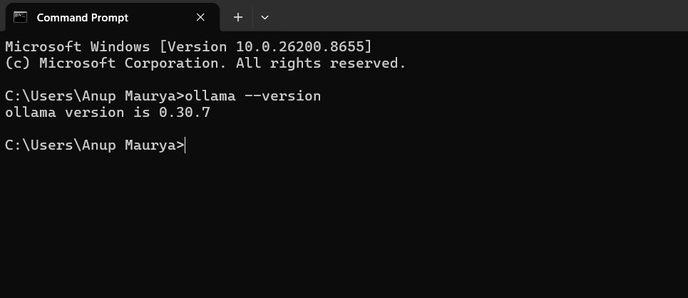
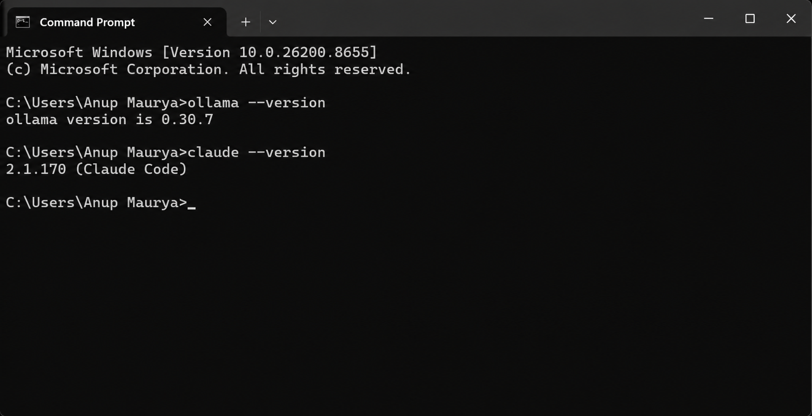
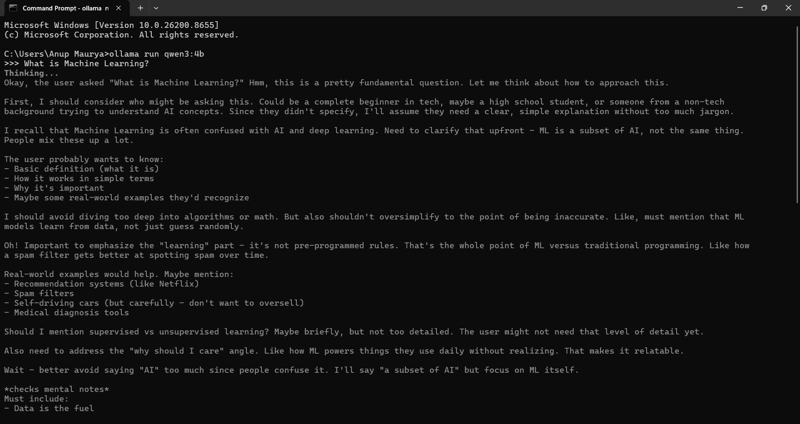

# Claude Code & Qwen Assignment

This repository contains the implementation and verification screenshots for the **Claude Code and Qwen Local AI Integration** assignment. The project demonstrates setting up a local LLM environment using Ollama, running the Qwen3:4b model, and integrating it with a Python application.

## 📋 Task Overview & Verification

### 1. Environment Setup & Installation (Tasks 1 and Task 2)
Verification of the core software installation and model acquisition.
- **Claude Code**: Installed and verified.
- **Ollama**: Engine installed and version confirmed.
- **Qwen Model**: `qwen3:4b` successfully pulled and listed.


*Figure 1: Successful installation of ollama.*


*Figure 2: Successful installation of Claude Code.*
---


### 2. Model Verification (Task 2 Continued)
Confirmation that the **Qwen3:4b** model was successfully downloaded and is available locally.
- **Command**: `ollama list`
- **Status**: Model `qwen3:4b` verified in the local library.


*Figure 2: Terminal output confirming the presence of the qwen3:4b model.*

---   

### 3. Model Execution (Task 3)
Interactive terminal session running the Qwen3:4b model to answer a conceptual query.
- **Query**: "What is Machine Learning?"
- **Result**: Model successfully generated a definition locally.


*Figure 3: Terminal output showing the model responding to the Machine Learning query.*

---

### 4. Python API Integration (Task 4)
Custom Python script (`app.py`) utilizing the Ollama API to send prompts and receive streaming responses.
- **Dependency**: `requests` library installed.
- **Query**: "What is the full form of AI?"
- **Result**: Script successfully captured user input and printed the model's JSON response.


*Figure 4: Execution of `app.py` showing user input and the generated AI response.*

---

## 🚀 How to Run

1. **Install Ollama**: Download from [ollama.com](https://ollama.com)
2. **Pull Model**:
   ```bash
   ollama pull qwen3:4b   
